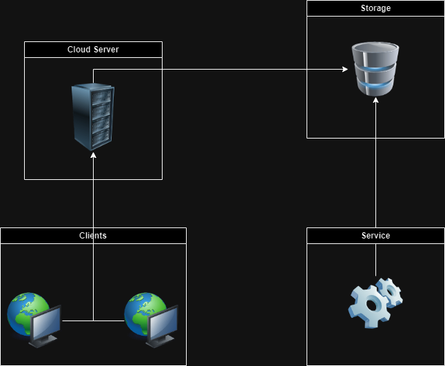
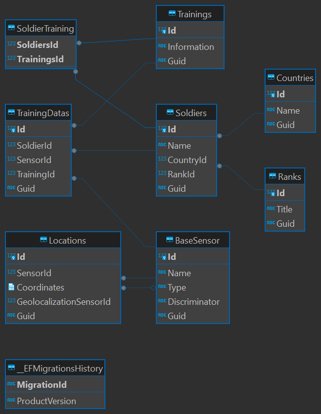

# SoldierTrackingAssesment

This application were divided in two projects one for DB infra and the other WCF app and also the integration tests.
The WCF part wasn't developed as well as the integration tests for that.

## Running the tests
Although the integration tests for the model were developed and in order to run them is required to setup the db, there is two ways to setup:

1. Docker 
	To run the container with MSSQL you must have Docker Desktop or other Container Orchastrator installed.
	Once it's installed just run the command:
	
	```sh
		docker run -e "ACCEPT_EULA=Y" -e "MSSQL_SA_PASSWORD=password123!" -p 1433:1433 -d mcr.microsoft.com/mssql/server:2022-latest
	```

2. Local MSSQL
	For this one you need to install MSSQL Express or other available version locally the setup the connection string with the required credentials.


## Architecture

Ideally for this application was designed to have the WCF application, as the main one, an web server and the MSSQL to store the data.
The design proposed will follow the architecture:



The cloud server will be responsible to update in near real time the desktop clients using a websockets.
The clould server will consult the storage to check if there is any change and then will send it to the clients that are connected to the server at the time.
The storage will be update from a background job that will receive the sensor data in real time.


## ER Diagram

The entities were splitted in:

- Rank - shared between all soldiers
- Country - shared between all soldiers
- Soldier - that belongs to rank and country
- BaseSensor/GeolocalizationSensor - Is entity that will be extended from its child using TPC and the GeolocalizationSensor it's the entity that is used for Locations
- Location - belongs to GeolocatizationSensor and it will store the coordinates
- Training - will store the training info and it will be shared between all soldiers
- TrainingData - Its a linking table between soldier, training and sensor

